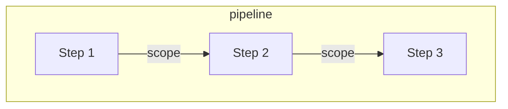
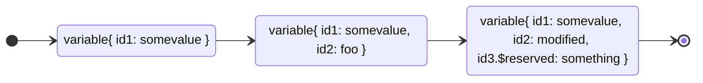
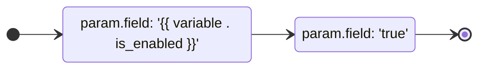

# go-pipeline

A toolkit to build processing pipelines using yaml.

## Table of contents

- [How does it work](#how-does-it-work)
- [How to](#how-to)
- [Available steps](#available-steps)
- [Customize](#customize)
- [Contributing](./docs/CONTRIBUTING)

## How does it work?

A **pipeline** is a set of **steps** to be executed in sequence. Every step has a **type** that defines what kind of processing should be done under a given **scope**, and returns the scope modified.



The step can modify the scope by adding **variables**, and this variable is carried over the whole pipeline. The variable can be retrieved in the scope by its path, and the step id will be used to build the path. Therefore, if multiple steps have the same id, the variable can be replaced.



During the step execution, their params can be dynamically evaluated along with the scope throught **expressions** following the [go template](https://pkg.go.dev/text/template). To use a variable set by a previous step, use the "variable" function passing the path, or "variableGet" to get a value from a map[string]any variable.



## How to

Create an YAML with the pipeline definition.

```yaml
id: range-example
steps:   
- id: some-step
  type: set
  params:
    list: '{{ list 1 2 3 4 5 6 7 8 9 10 | toJson }}'
- type: range-json
  params:
    source: '{{ variableGet . "some-step" "list" }}'
    concurrency: '{{ env "RANGE_CONCURRENCY" | default "2" }}'
    steps:
    - type: log
      params:
        message: '{{ printf "Processing %d item: %v" ( variable . "$rangeIndex" ) ( variable . "$rangeItem" )}}'
```

Load the pipeline passing the folder path, and execute.

```go
import (
  "context"
  "os"
  "github.com/crowleyfelix/go-pipeline/pkg/log"
  "github.com/crowleyfelix/go-pipeline/pkg/pipeline"
)

func main() {
  log.SetUp(log.Standard{})
  pipelines, err := pipeline.Load(os.DirFS(os.Getenv("PIPELINE_DIR")))
  if err != nil {
    log.Fatal(err)
  }

  scope := pipeline.NewScope(pipelines)
  scope, err = pipelines.Execute(context.Background(), scope, "range-example")
  if err != nil {
    log.Fatal(err)
  }
}
```

or execute the cli

```bash
PIPELINE_FOLDER=./example PIPELINE_IDS=range-example go run cmd/*.go
```

You can see more examples [here](./example/).

## Available steps

### Basic

| **Step Type**       | **Parameter**       | **Type**               | **Description**                                                                                     |
|----------------------|---------------------|------------------------|-----------------------------------------------------------------------------------------------------|
| **set**              | `params`           | `map[string]any`      | Key-value pairs to set in the pipeline scope.                                                   |
| **stop**             | `condition`        | `bool`                | Condition to stop the pipeline.                                                                   |
|                      | `message`          | `string`              | Message to log when stopping the pipeline.                                                        |
|                      | `is_error`         | `bool`                | Whether stopping the pipeline should be treated as an error.                                       |
| **range-json**       | `source`           | `json`                | JSON array to iterate over.                                                                       |
|                      | `concurrency`      | `int`                 | Number of concurrent executions.                                                                  |
|                      | `steps`            | `[]step`              | Steps to execute for each item in the JSON array.                                                 |
| **log**              | `message`          | `string`              | Message to log. Can use Go templates for dynamic content.                                          |
| **until**            | `condition`        | `bool`                | Condition to evaluate for repeating the pipeline.                                                 |
|                      | `steps`            | `[]step`              | Steps to execute repeatedly until the condition is false.                                         |
| **wait**             | `duration`         | `duration`            | Duration to wait before proceeding to the next step.

### Plugins

The following steps should be registered before it's used.

eg.:

```go
import (
  httplib "net/http"
  "github.com/crowleyfelix/go-pipeline/pkg/http"
)

func main() {
  http.RegisterStepExecutor(httplib.DefaultClient)
}

```

| **Step Type**       | **Parameter**       | **Type**               | **Description**                                                                                     |
|----------------------|---------------------|------------------------|-----------------------------------------------------------------------------------------------------|
| **http**            | `url`              | `string`              | The URL to send the HTTP request to. Supports Go templates and pipeline scopes.                  |
|                      | `method`           | `string`              | The HTTP method (e.g., GET, POST).                                                                |
|                      | `body`             | `string`              | The body of the HTTP request. Can use Go templates for dynamic content.                            |
|                      | `header`           | `map[string]string`   | HTTP headers as key-value pairs.                                                                  |

## Go Template Functions


| **Function**         | **Description**                                                                                     | **Example**                                                                                     |
|-----------------------|-----------------------------------------------------------------------------------------------------|-----------------------------------------------------------------------------------------------|
| `variable`            | Retrieves a value from the pipeline scope variable using its path.                                  | `{{ variable . "step-id" }}`                                                                   |
| `variableGet`        | Retrieves a specific key from a map[string]any stored in the pipeline scope variable.                   | `{{ variableGet . "step-id" "key" }}`                                                         |
| `jsonPath`           | Extracts data from a JSON string using a JSONPath expression.                                        | `{{ jsonPath "$.items[0].name" "{\"items\": [{\"name\": \"example\"}]}" }}`                   |

Besides the standard library functions, all functions from the [sprig](https://masterminds.github.io/sprig/) library are availble.

## Customize

It's possible to extend the go-pipeline by registering step executors and go template functions.

```go
package main

import (
  "fmt"
  "context"
  "html/template"

  "github.com/crowleyfelix/go-pipeline/pkg/expression"
  "github.com/crowleyfelix/go-pipeline/pkg/pipeline"
)

type CustomParams struct {
  Name expression.Field[string] `yaml:"name"`
}

func main() {
  pipeline.RegisterStepExecutor("custom", func(ctx context.Context, scope pipeline.Scope, step pipeline.Step) (pipeline.Scope, error) {
    params, err := pipeline.StepParams[CustomParams](step.Params)
    if err != nil {
      return scope, err
    }

    name, err := params.Name.Eval(ctx, scope)
    if err != nil {
      return scope, err
    }

    value := fmt.Sprintf("officer %s", name)

    return scope.WithVariable(step.VariablePath(), value), nil
  })

  expression.RegisterFuncs(template.FuncMap{
    "greeting": func(scope pipeline.Scope, path pipeline.VariablePath) (string, error) {
      value, err := scope.Variable(path)

      return fmt.Sprintf("hello, %s", value), err
    },
  })
}
```

And the registered plugins can be used like this

```yaml
id: my-pipeline
steps:
- id: previous-step
  type: custom
  params:
    name: 'Bob'
- type: log
  params:
    message: '{{ greeting . "previous-step" }}'
```
